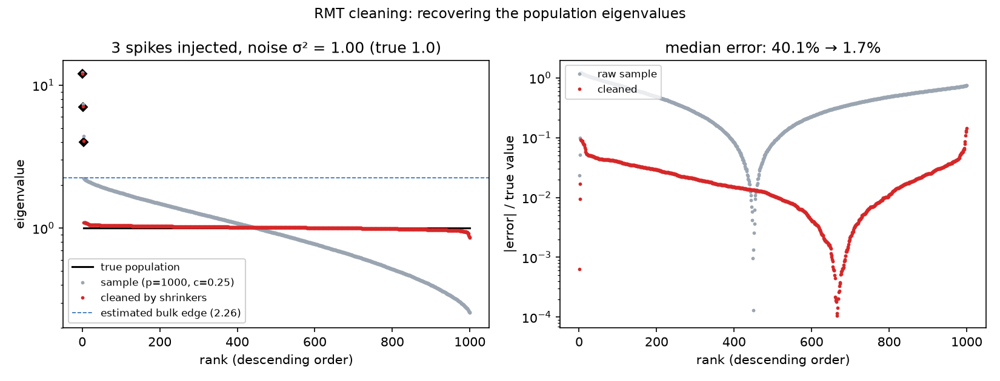
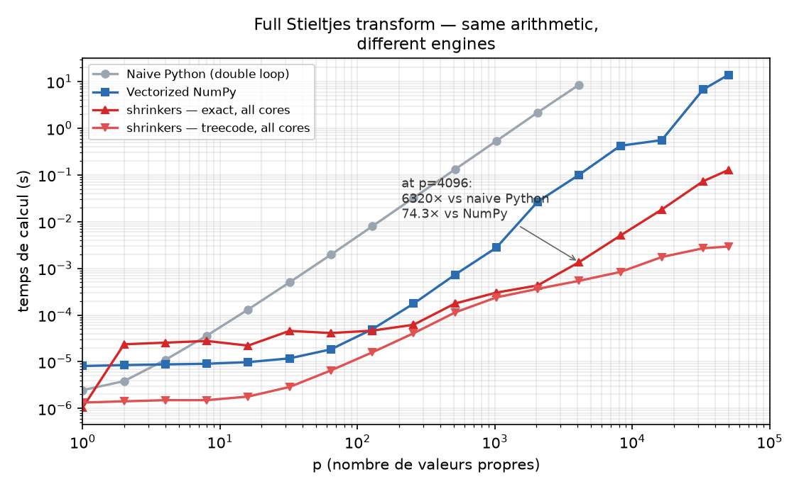

# shrinkers

[](https://github.com/alexisrosuel/shrinkers/actions/workflows/ci.yml)
[](https://github.com/alexisrosuel/shrinkers/blob/main/LICENSE)

**Fast RMT (Random Matrix Theory) Population Eigenvalue Estimation Kernel**

SIMD-accelerated Rust implementation of **spiked + bulk eigenvalue cleaning**
via free-probability deconvolution: detect spikes (BEMA), debias them (inverse
BBP), and deconvolve the bulk (El Karoui). Features O(p log p)
FFT-accelerated Stieltjes transforms, auto-vectorized loops, cache blocking,
multi-threaded kernels (**~6× on an 8-core machine**, one keyword away),
and PyO3 bindings.

## Why shrinkers?

**1 · It actually un-distorts the spectrum.** Sample eigenvalues of a
high-dimensional covariance are biased artifacts: the bulk is smeared over
`[(1−√c)², (1+√c)²]·σ²`, genuine spikes are compressed toward the edge.
`shrinkers` inverts that distortion and recovers the population spectrum:



*Spiked model, p = 1000, c = 0.25, σ² = 1, three spikes injected at 12 / 7 / 4.
All 3 spikes are detected and debiased to within 1 % (12.01 / 7.07 / 4.07),
the noise level is estimated at σ̂² = 1.002, and the median relative error
against the true population eigenvalues drops from **40 % to 4.3 %** in a
single call (`estimate_population_eigenvalues`).*

**2 · It is absurdly fast for what it computes.** Same math as your NumPy
one-liner, orders of magnitude faster — compared below against the two
baselines people actually write: a textbook pure-Python double loop, and a
vectorized NumPy version:



*Full transform of all p points, log-log over the whole 10⁰–10⁵ range,
η = 1/√p, Apple M1 Max, NumPy 2.5.1.*

| p | Naive Python | NumPy | shrinkers exact ¹ | shrinkers treecode ² |
|---|---|---|---|---|
| 1 024 | 0.53 s | 2.8 ms | **0.30 ms** · 9× | **0.24 ms** · 12× |
| 4 096 | 8.6 s | 101 ms | **1.4 ms** · 75× | **0.54 ms** · 187× |
| 50 000 | *(~2 h extrapolated)* | 13.9 s | **0.13 s** · 109× | **2.9 ms** · ≈4700× |

¹ machine precision — the zero-error anchor.  ² `chebcode_fast` preset,
rel. error ~1e-8: giving up four digits of accuracy buys two more orders of
magnitude in speed, and the higher-precision `chebcode` preset (~5e-10)
costs nearly the same (see [docs/internals.md](docs/internals.md)).
At microsecond scales both
shrinkers curves flatten onto their fixed Python-call overhead (the pure
kernel-level crossover study lives in [docs/internals.md](docs/internals.md)).
Every number is reproducible: `scripts/make_readme_figures.py`
regenerates both figures end-to-end, and `docs/img/readme_figures.json`
holds the raw measurements.

**3 · It uses every core you give it.** The exact kernel is data-parallel
across cache blocks — flip one argument (`parallelism="rayon"`) and the
same call spreads over your cores with no reduction step and no false
sharing. Measured on the 8-core machine above (fresh sweep,
`docs/pareto/bench_after.json`):

| p | exact, 1 thread | exact, all cores | gain |
|---|---|---|---|
| 10 000 | 38.6 ms | 6.4 ms | **×6.0** |
| 50 000 | 0.94 s | 0.16 s | **×5.9** |

The Chebyshev treecode scales too (×3.3–4.5); only the FFT-grid path is
single-threaded by design. Note also that the NumPy baseline in figure 2
is itself single-core — even pinned to one thread, shrinkers still wins
by roughly an order of magnitude (9.1× at p≈5000).

### What's inside

- `deconvolve_spiked(evals, c)` — the one-call pipeline: BEMA detection →
  inverse-BBP spike debiasing → El Karoui bulk deconvolution;
- 21 Stieltjes-transform variants spanning the whole speed/accuracy frontier —
  machine-precision exact kernels, Chebyshev treecodes (~1e-8 … ~6e-13),
  FFT grids, HODLR — plus data-driven `speed_auto` / `accuracy_auto` picks;
- correlation-matrix cleaning with eigenvector-overlap correction, direct
  precision-matrix shrinkage, Tracy–Widom spike detection;
- Rust API + PyO3 bindings with the GIL released during computation;
- multi-core execution built in — exact and treecode kernels parallelize
  via Rayon (`parallelism="rayon"`).

## Quickstart

The **core** of the crate is a single call that cleans the sample eigenvalues
under a spiked covariance model, recovering the population spectrum:

```python
import numpy as np
from shrinkers import deconvolve_spiked

# --- example input: a sample spectrum drawn from a spiked covariance ---
# Population: Marchenko-Pastur bulk (sigma^2 = 1, c = 0.25) plus three
# spikes at 12, 7 and 4. The sample eigenvalues come from n = p/c
# Gaussian observations of that diagonal covariance.
rng = np.random.default_rng(0)
p, c = 1000, 0.25
pop = np.concatenate([[12.0, 7.0, 4.0], np.ones(p - 3)])
y = rng.standard_normal((p, round(p / c))) * np.sqrt(pop)[:, None]
evals = np.linalg.eigvalsh((y @ y.T) / y.shape[1])   # ascending sample spectrum

res = deconvolve_spiked(evals, c=c)
print(res["k"])                 # -> 3 detected spikes
print(res["spikes"])            # -> [11.96 7.1 3.93] debiased (true: 12, 7, 4)
print(res["bulk"]["lambda_grid"][:4],   # grid + deconvolved bulk density
      res["bulk"]["density"][:4])       # profile on a 200-point grid
```

## How it works (30-second version)

One call, three steps:

1. **Detect** — sample eigenvalues that escape the bulk edge are flagged as
   spikes (real signal, e.g. factors).
2. **Debias** — each spike is mapped back to its true population value,
   undoing the upward push that high-dimensional noise inflicts on large
   eigenvalues.
3. **Deconvolve** — spikes removed, the remaining bulk is inverted through
   the Marčenko–Pastur equation to recover the population density.

This is useful for factor-model selection, noise validation, signal
extraction, and covariance estimation when the noise is not i.i.d. white.
The math (Stieltjes transforms, BBP inverse, El Karoui inversion) lives in
[docs/internals.md](docs/internals.md).

## Python usage

```python
from shrinkers import deconvolve_spiked
import numpy as np

evals = np.array([0.5, 1.0, 2.0, 3.0, 5.0, 10.0], dtype=np.float64)

# Clean the sample eigenvalues (spiked + bulk deconvolution)
res = deconvolve_spiked(evals, c=0.3)
print(res["k"])                 # -> 1 detected spike
print(res["spikes"])            # -> [8.779] debiased population spike
                                #    (sample value was 10; BBP pulls it down)
print(res["bulk"]["density"].shape)     # -> (200,) deconvolved bulk density
```

See `docs/python_api.md` for the full API reference.

## Comparison with existing packages

The only other Python package implementing RIE shrinkage is **pyRMT** (PyPI). Our comparison (a one-off benchmark script, since removed from `scripts/`; the reference NumPy implementation lives in `scripts/rie_numpy.py`) reveals:

### 🐛 pyRMT has a critical bug

`pyRMT.stieltjes(z, E)` computes $\operatorname{tr}(zI - E)$ instead of the correct $\operatorname{tr}\bigl((zI - E)^{-1}\bigr)$ — the matrix inverse is missing. This makes its RIE shrinkage completely wrong (~360% relative error).

| Method | p=100, c=0.5 | p=500, c=0.5 |
|--------|-------------|-------------|
| `rie_numpy` (ref) | ✅ ground truth | ✅ ground truth |
| `shrinkers` (Rust autovec) | **1.2e-14** max diff | **4.4e-14** max diff |
| `shrinkers` (Rust FFT) | **9.5e-03** (0.15% error) | **3.0e-02** (0.16% error) |
| pyRMT (fixed, same η) | 3.3e-01 (2.5% error, η effect) | 6.2e-01 (1.7% error, η effect) |
| **pyRMT (original buggy)** | **❌ 1.7e+01 (358% error)** | **❌ 1.9e+01 (376% error)** |

Note: pyRMT uses $\eta = 1/\sqrt{p}$ vs our $0.1/\sqrt{p}$. When using the same η, both give identical results up to machine precision. The γ bias correction in pyRMT's `optimalShrinkage` has negligible effect at moderate p.

### Performance vs pyRMT

> Note: the earlier `stieltjes_transform` / RIE entry point has been replaced
> by `deconvolve_spiked` (spiked + bulk deconvolution). The `shrinkers` rows
> below are the current `deconvolve_spiked` timings (n_points=200).

| Method | p=100 | p=500 | p=1000 | Scaling |
|--------|-------|-------|--------|---------|
| **`shrinkers` deconvolve_spiked** | **9.4 µs** | **33.2 µs** | **63.2 µs** | O(p²) |
| `rie_numpy` (pure NumPy) | 60 µs | 1337 µs | 5381 µs | O(p²) |
| pyRMT (fixed, loop-based) | 1164 µs | 2695 µs | 6642 µs | O(p²) |
| **pyRMT (original buggy)** | **928 000 µs** | **1 474 000 µs** | — | **O(p³)** |

Key findings:
- **`shrinkers` is 6–80× faster than `rie_numpy`** and **~100–120× faster than pyRMT (fixed)** at p=100
- The **buggy pyRMT is O(p³)**: 928 ms at p=100, making it unusable beyond tiny dimensions
- The **hardware-optimized `Blocked` kernel** beats FFT methods below p≈2000 in pure Rust (see [docs/internals.md](docs/internals.md))

### Why `shrinkers` is the only correct & fast RIE

| Feature | pyRMT | Ledoit-Wolf (official) | **shrinkers** |
|---------|-------|----------------------|----------------|
| RIE algorithm | ✅ (but buggy) | ❌ (different method) | **✅ correct** |
| FFT acceleration | ❌ | ❌ | **✅ O(p log p)** |
| Eigenvalue-only API | ❌ (needs X) | ❌ (needs X) | **✅ yes** |
| SIMD auto-vectorization | ❌ | ❌ | **✅ NEON/AVX2** |
| Multiple strategies | ❌ | ❌ | **✅ 21 method variants** |
| Zero unsafe code* | N/A | N/A | **✅ (1 audited module)** |
| Maintenance | Last updated 2017 | Sporadic | **✅ Active** |

## Documentation

- [`docs/python_api.md`](docs/python_api.md) — full Python API reference;
- [`docs/internals.md`](docs/internals.md) — method map, algorithm math, the
  complete benchmark record and the unsafe-code policy;
- [`CHANGELOG.md`](CHANGELOG.md) — release history and known caveats.

## Development

The project is managed with **pixi** (conda-forge) for the Python environment and
**Cargo** for the Rust crate. The Python extension is built with **maturin** (PyO3).

### Toolchain

| Tool | Purpose | Managed by |
|------|---------|-----------|
| Rust (stable) | Core SIMD kernel | rustup |
| Cargo | Rust build/bench/test | rustup |
| pixi | Python env + tasks | pixi |
| Python 3.14 | Python bindings & scripts | pixi |
| maturin | PyO3 extension build | pixi |
| numpy / scipy / matplotlib | Python numerics & plotting | pixi |
| pytest / ruff / mypy | Python test, lint, type-check | pixi |

### Setup

```bash
# Create the pixi environment (installs Python, numpy, scipy, maturin, dev tools)
pixi install

# Build the Rust extension into the pixi env (release)
pixi run build
```

### Common tasks (via pixi)

```bash
pixi run build          # maturin develop --release
pixi run build-debug    # maturin develop (debug)
pixi run test           # cargo test
pixi run test-py        # pytest tests (Python API tests; run `pixi run build` first)
pixi run lint           # cargo clippy --all-targets -- -D warnings
pixi run lint-py        # ruff check scripts tests
pixi run fmt            # cargo fmt
pixi run fmt-check      # cargo fmt --check
pixi run type-py        # mypy scripts tests
pixi run bench-stieltjes  # python scripts/bench_stieltjes.py
pixi run measure        # python scripts/measure_current.py
```

### Rust benchmarks

```bash
cargo bench --bench comparison   # dispatch-level method matrix (p=500/1000)
cargo bench --bench peropt       # full configuration sweep
cargo bench --bench cache_tiling # block-size landscape
cargo bench --bench tiled_opt    # raw tiled-kernel micro-benchmarks
```

## License

MIT