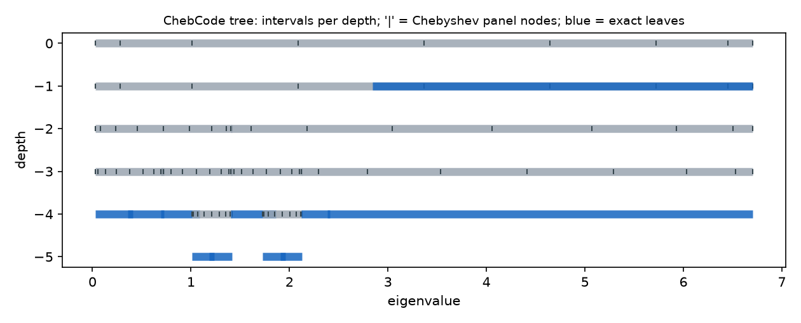
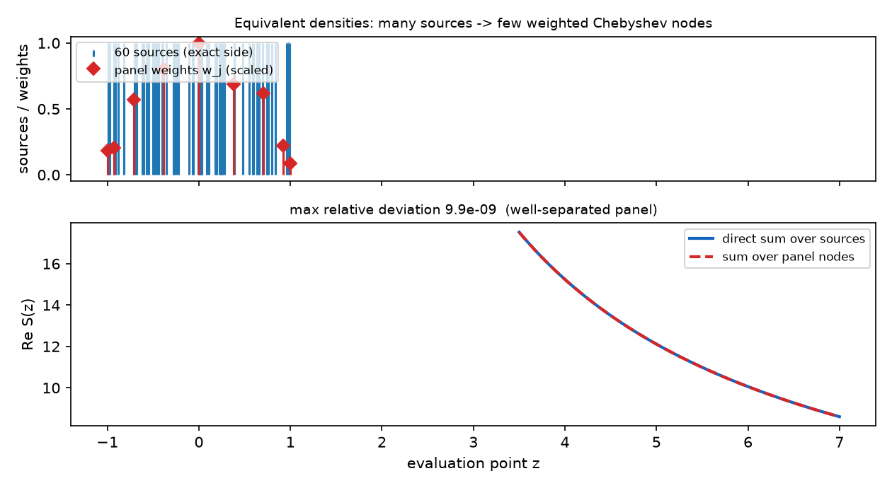
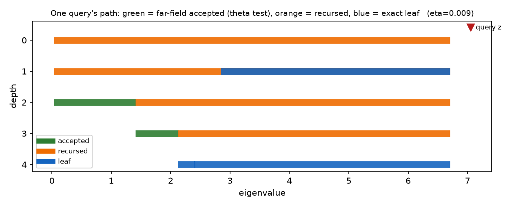
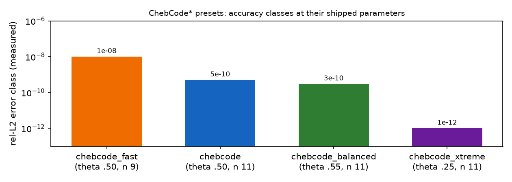

# The ChebCode* family: algorithm reference

`ChebCode`, `ChebCodeFast`, `ChebCodeBalanced` and `ChebCodeXtreme` share
one implementation — a Chebyshev-interpolation treecode over the sorted
eigenvalue set (`src/stieltjes/chebcode.rs`). They are the least trivial
methods in the crate and also the ones every fast code path ends up using,
so this document records how they actually work. Everything below is
described as implemented; measured numbers trace to the referenced files.

## Problem

All evaluation paths reduce to

    S(x_k) = Σ_j 1 / ((x_k − λ_j) − iη),      k = 1..Q

where `p` is the number of (sample) eigenvalues λ_j, `i` the imaginary
unit, and η the regularization offset — an imaginary shift keeping every
denominator nonzero; the library default is η = 0.1/√p
(see [`eta_choice.md`](eta_choice.md)). `Q` is the number of query points:
with Q = p when cleaning eigenvalues (`rie_shrinkage`) and Q = n_points
(default 200) on the deconvolution grid (`compute_stieltjes_at_points`).
Direct summation is O(p·Q). The treecode makes both large cases
O((p + Q) log p).

## Tree layout

Sources are sorted ascending (skipped defensively if already sorted — an
O(p) check against an O(p log p) sort; the pipeline always passes sorted
input). A balanced binary tree is then built recursively:

* a node covers a value interval `[lo, hi]` and a contiguous source range
  `[lo_idx, hi_idx)` into the sorted array;
* splitting happens at the **midpoint of the value interval**
  (`partition_point` on the sorted range), not the median of counts —
  children get geometrically balanced intervals, which is what keeps the
  opening-angle test meaningful (the test compares a node's half-width
  against θ × its distance to the query; θ is defined in
  [Traversal](#traversal)); degenerate splits fall back to the index
  midpoint;
* recursion stops when a node holds ≤ `leaf_cap` sources (leaves carry
  their sources exactly);
* everything lives in structure-of-arrays vectors (`lo`, `hi`, `hw_sq`,
  `lo_idx`, `hi_idx`, child indices as `i32` with `-1` marking a leaf,
  plus the per-node panel positions and weights described below) — no
  pointer chasing, cache-friendly traversal.

Depth is ⌈log₂(p / leaf_cap)⌉ ≈ 11 levels at p = 50 000 with leaf_cap 32.

## Equivalent densities on Chebyshev panels

Every node owns `n` Chebyshev nodes of the second kind mapped onto its
interval, `t_j = c + l·s_j` with `(c, l)` the interval center/half-width
and `s_j ∈ [−1, 1]` the shared node template (built once per tree). On
each panel, the sources of that panel are replaced by **equivalent
densities** `w_j`: the unique set of weights such that the rational

    F(z) = Σ_j w_j / (z − t_j)

reproduces the kernel sum at every source location of the panel — the
barycentric Lagrange row-update. For each panel source `x_s`:

    v_j = β_j / (x_s − t_j),   w_j += v_j · (Σ_i v_i)⁻¹,

where `β_j = (−1)^j` (halved at the endpoints) are the barycentric
weights — distinct from the eigenvalues λ_j of the Problem section. If
`x_s` hits a node exactly, that single weight absorbs the mass.
Leaf weights therefore sum exactly to the leaf's source count.

The figure computes the real construction (same normalized barycentric
row update) for 60 sources on one panel, evaluating only where the θ
test (opening angle, defined in [Traversal](#traversal)) would accept it — see `scripts/make_chebcode_figures.py` for the exact
computation behind the printed deviation.

Two implementation details matter:

* **division hoisting**: `v_j` needs one division per (source, node), but
  the normalization adds only one division per source — numerically
  identical up to ≤1 ulp;
* **parent composition** (`merge_weights`): a parent's weights are merged
  from its two children's already-computed weights (each child's row
  update scaled by its mass), replacing a full rescan of the parent's
  sources. Build cost drops from ~p·n·depth source-visits to O(n²) work
  per node merge; it stacks one extra interpolation level of rounding per
  depth, which the treecode tolerance absorbs (verified against exact sums
  in tests).

Measured share of end-to-end runtime: **build is 10–11 %** at p = 20k–50k
(`examples/measure_build_share.rs`) — evaluation dominates.

## Traversal

Per query point `z = x − iη` (x is z's real part), a stack-based DFS
visits nodes; three cases. Notation used below, defined here once:

* `hw ≡ (hi − lo)/2` — a node's half-width (`hw_sq` in code is its square);
* `cl ≡ max(lo − x, x − hi, 0)` — the *clamped* distance from the query's
  real part to the node interval (zero inside it), computed branchlessly;
* `θ ∈ (0, 1)` — the **opening angle**: the acceptance knob of the whole
  family. A node is "well separated" iff `hw² < θ²·(cl² + η²)`; larger θ
  accepts panels farther away ⇒ fewer recursions ⇒ faster and less
  accurate. Each preset ships its own θ (table below); `theta_sq` is just
  θ² hoisted out of the loop.

1. **leaf** — exact pairwise sum over its sources with the SIMD two-lane
   helper (`F64x2`, refined Newton–Raphson reciprocal because AArch64 has
   no FP64 vector divide; see `stieltjes::simd`). Same lane layout as the
   far-field loop.
2. **internal, well-separated** — i.e. the test above passes. Accepted ⇒
   far-field contribution

        Re += Σ_j w_j·(z − t_j)/((z − t_j)² + η²),
        Im += Σ_j w_j·η/((z − t_j)² + η²),

   evaluated **term-by-term** on the panel's `n` nodes with the same
   refined-reciprocal SIMD loop. Two documented design choices:
   - processing panels in pairs measured ~10 % slower (the n-loop is
     already independent; pairing only doubles live registers);
   - per-term dot product instead of polynomial coefficients + single
     Horner division: monomial coefficients of degree-n polynomials whose
     roots cluster near ±1 amplify rounding catastrophically (measured
     relative errors of 10²–10³), while the dot product evaluates every
     denominator exactly like the leaf loop — unconditional stability.
3. **not separated** — recurse into children.

The result is returned in the caller's original order although the tree is
built on the sorted multiset.

## Complexity

Per query: O(log p) levels × O(accepted panels × n) far-field work +
O(leaf_cap) near-field work. With θ = 0.5 roughly half the angular
neighborhood is accepted at each level, giving the observed
O((p + Q)·log p)-class scaling and the measured runtimes in
`docs/pareto/bench_after.json` (ChebCodeFast: 2.3 ms at p = 10⁴ sequential,
12–13 ms at p = 5×10⁴).

## Presets

| method | θ | n | leaf_cap | error class | note |
|---|---|---|---|---|---|
| `chebcode` | 0.50 | 11 | 32 | ~5e-10 | dispatch default preset |
| `chebcode_fast` (`chebf`) | 0.50 | 9 | 32 | ~1e-8 | fastest; owns most speed bins |
| `chebcode_balanced` (`chebb`) | 0.55 | 11 | 32 | ~3e-10 | FAST+6 % runtime |
| `chebcode_xtreme` (`chebx`) | 0.25 | 11 | 16 | ~1e-12/13 | precision niche |

Parameter sensitivity, measured with
`examples/measure_cheb_sweep.rs` (interleaved A/B, error vs the exact
kernel):

* raising θ trades accuracy for fewer near-field recursions — θ = 0.55
  with n = 9 gains 4–7 % but showed a bad-seed tail (rel error 2.5e-7 on
  one seed at p = 10⁴ vs 8.5e-9 median over six seeds), breaking FAST's
  documented class; the same θ with n = 11 is rock-stable across seeds
  and became `Balanced`;
* lowering θ or shrinking leaf_cap costs time without accuracy benefit
  in the tested range; larger leaf caps lose time to longer exact loops.

## η coupling and stability

η appears twice: in the leaf/far-field denominators and inside the
separation test (`d² = cl² + η²`). Consequences:

* runtime is essentially η-independent (measured flat in
  `docs/eta_choice.md`);
* very small η pushes the separation boundary outward and sharpens the
  near-field denominators — the reason the library default is
  0.1/√p (see `docs/eta_choice.md` for the full analysis);
* near-degenerate eigenvalues (gaps down to 1e-11 were observed in tests)
  stay exact because leaves sum their own sources directly.

## Batch API and parallelism

`ChebCodeBatch::build(eigenvalues, theta, n, leaf_cap)` builds the tree
once; `evaluate_points(&points, eta, parallel)` serves any number of
queries from it — this is what makes the deconvolution grid cheap after
one construction, and what benchmarks use to separate build from
evaluation. Parallel mode chunks queries into blocks of 256 (measured
plateau between 64 and 1024 at p = 50 k on M1 Max): each task reuses one
stack buffer across consecutive queries, which keeps cache warmth high
because adjacent sorted values traverse nearly identical paths.

## Where it is used

* `rie_shrinkage` / `shrink_eigenvalues` — transform evaluated at the
  eigenvalues themselves;
* `deconvolve_spiked` / `spectral_deconvolution` — grid evaluation through
  `compute_stieltjes_at_points`, which routes the whole ChebCode family to
  tree-once/evaluate-many (before that routing existed, the family fell
  back to an O(p²) scalar sweep **per grid point**, making the spiked
  pipeline quadratic despite selecting a treecode);
* Python aliases: `"chebcode"`, `"chebcode_fast"`/`"chebf"`,
  `"chebcode_balanced"`/`"chebb"`, `"chebcode_xtreme"`/`"chebx"`.

Reproduce the measurements: `examples/measure_cheb_sweep.rs`,
`measure_xtreme_duel.rs`, `measure_build_share.rs`; frontier data under
`docs/pareto/`.
